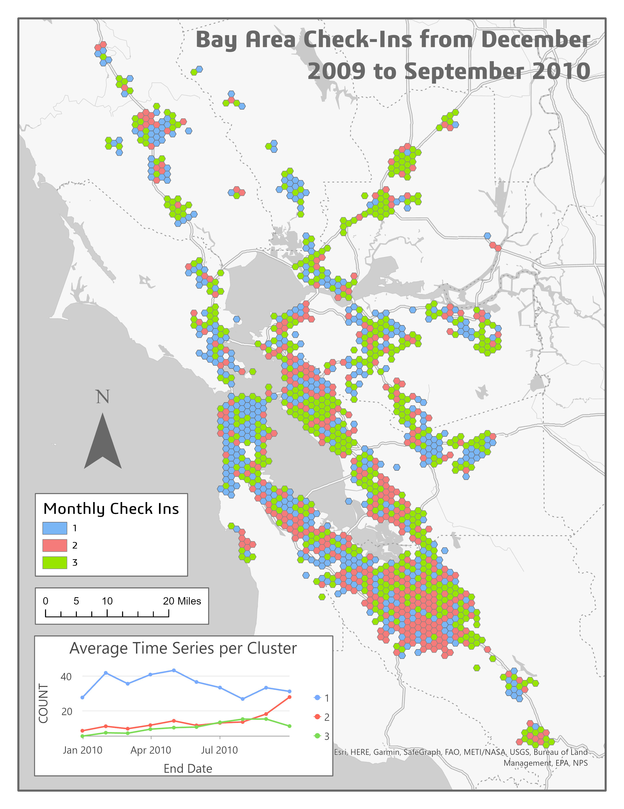
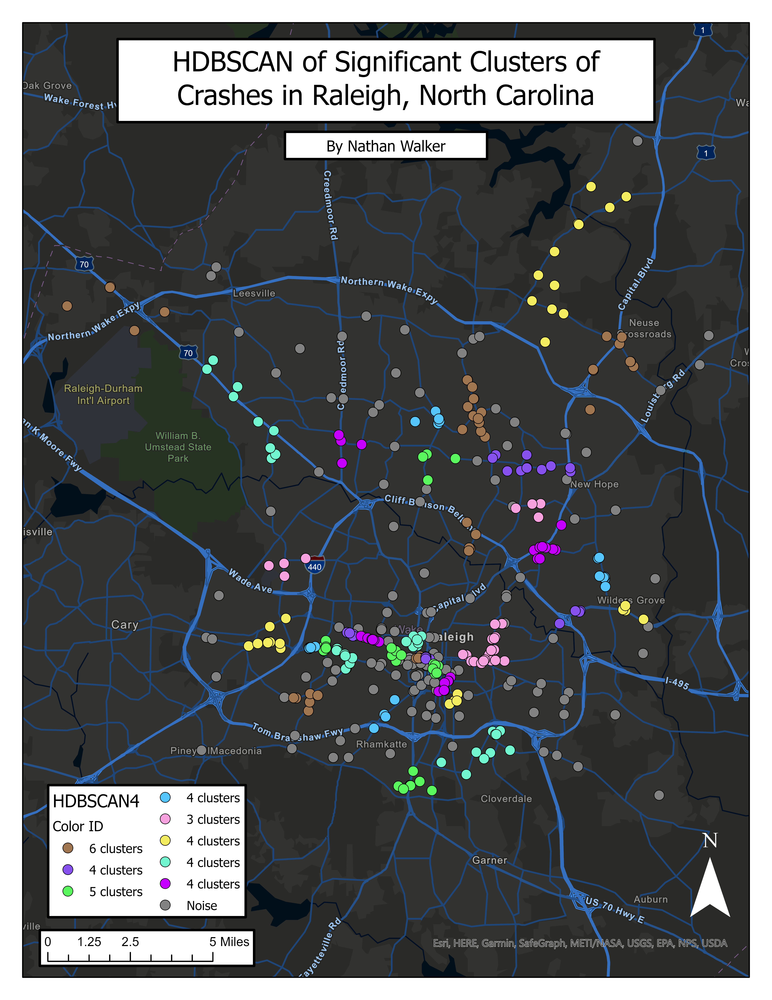
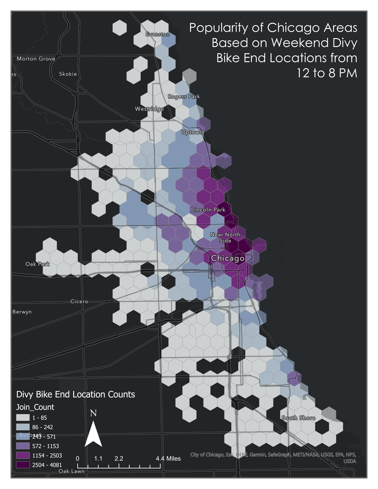
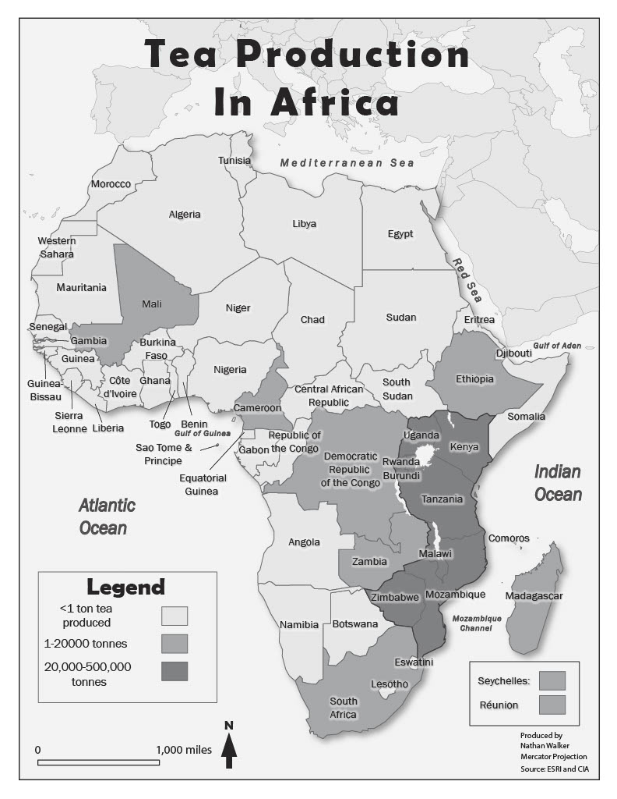
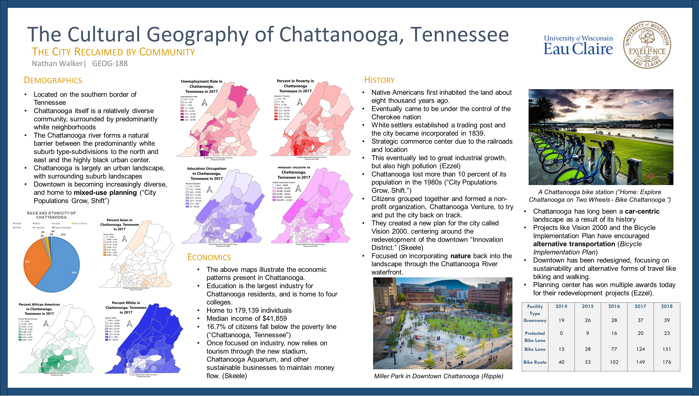
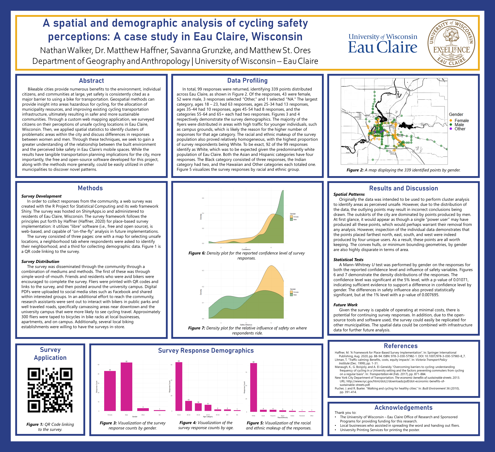
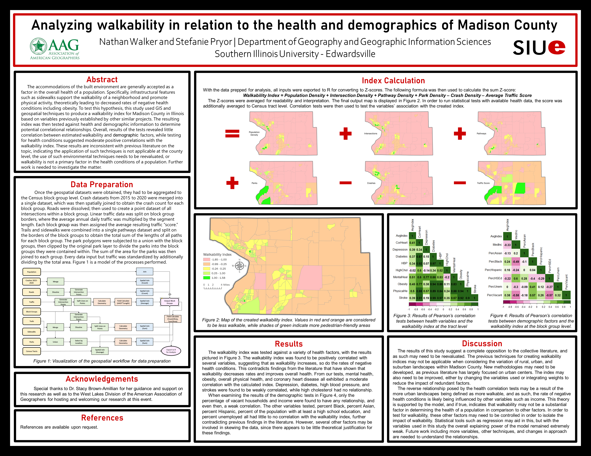

# Nathan Walker's Digital Portfolio

## About

Hello, thank you for taking the time to investigate my portfolio! My name is Nathan Walker, and I am currently pursuing a Master's of Science in Geography at Southern Illinois University Edwardsville. I received my undergraduate degree from University of Wisconsin - Eau Claire in Geography and Economics. 
  

 With my undergraduate experiences, I discovered a passion for working with data to create inferences and build recommendations for courses of actions. Geography and economics prepped me well to handle datasets, with a diverse toolbox of geospatial and econometric techniques. I pride myself on expanding my knowledge beyond the conventional tools such as ESRI options, and am always looking for new experiences to build my options for analysis and grow as a person. Below are several examples of previous projects I have worked on. If you would like more information, feel free to contact me!

  
---
**Email**: natewalk22@gmail.com 
**LinkedIn**: https://www.linkedin.com/in/nathan-walker-bb22301bb/

---
# Projects
## Maps
### Time Series Analysis

---
### Cluster Analysis

---
### Divy Bikes in Chicago Popularity Tessellation

---
## Adobe Illustrator Maps  

---
## Research Papers  
### Hobbit or “Kiwi:” Lord of the Rings Tourism, Sustainability, and National Identity
[Tourism_Hobbit_Or_Kiwi.pdf](Tourism_Hobbit_Or_Kiwi.pdf)  
### Vietnam National Instagram Content Analysis
[Vietnam_Instagram_Analysis.pdf](Vietnam_Instagram_Analysis.pdf)
### Nuclear Site Suitability Analysis for Wisconsin
[NuclearCourseProject](NuclearCourseProject.docx)
### Capstone Project: Analyzing Potential Increased Exposure of Demographic and Socioeconomic Populations To The Urban Heat Island In Milwaukee, Wisconsin
[CapstoneProject](CapstonePaper.pdf)

## Web Applications
### Environmental Equity in Madison County
https://natewalk.shinyapps.io/MadisonCountyEnvironmentalEquity/
### Spatial Autocorrelation Educational Tool
[Spatial Autocorrelation](https://natewalk.shinyapps.io/SpatialAutocorrelation/)

## Posters
 

## Tutorials  
[GeodatabaseTutorial.pdf](GeodatabaseTutorial.pdf) 
 
[Hospital Site Tutorial](https://natewalk22.github.io/GISHospitalTutorial/)
